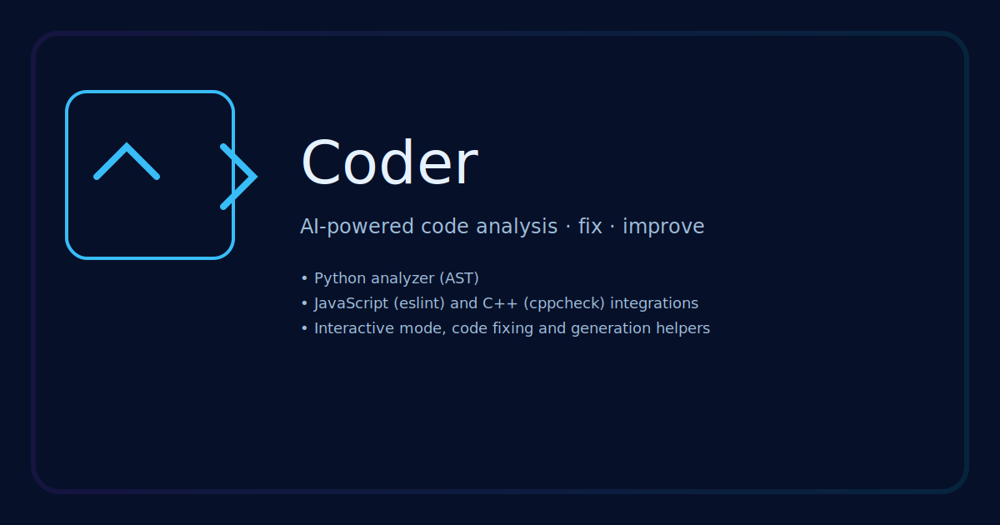
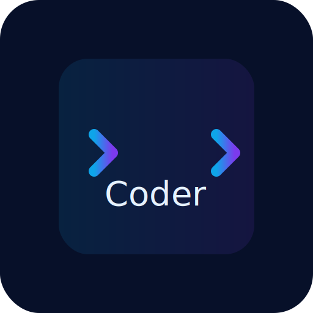

# Coder

  

Coder — AI-проект для анализа, исправления и улучшения кода.

Коротко:
- Python-анализ (AST)
- Интеграция с ESLint (JS) и cppcheck (C++)
- Интерактивный режим, исправление и генерация кода

Где находятся изображения

- SVG исходники: assets/logo.svg, assets/banner.svg, assets/social_preview.svg
- Сгенерированные PNG (через workflow или локально): assets/png/logo-256.png, assets/png/banner-800x200.png, assets/png/social-1200x630.png

Команды для локальной конвертации SVG → PNG

- С помощью rsvg-convert (librsvg):

```bash
# установить на Ubuntu/Debian
sudo apt-get update && sudo apt-get install -y librsvg2-bin

# сгенерировать PNG
rsvg-convert -w 256 -h 256 assets/logo.svg -o assets/png/logo-256.png
rsvg-convert -w 800 -h 200 assets/banner.svg -o assets/png/banner-800x200.png
rsvg-convert -w 1200 -h 630 assets/social_preview.svg -o assets/png/social-1200x630.png
```

- С помощью Inkscape:

```bash
inkscape assets/logo.svg --export-type=png --export-width=256 --export-filename=assets/png/logo-256.png
```

Автоматическая генерация PNG в репозитории

- Ветка feat/logo содержит workflow `.github/workflows/generate_pngs.yml`, который при пуше в ветку `feat/logo` попытается сгенерировать PNG-версии и запушить их обратно в ту же ветку.

Локализации (locales)

- В каталоге `locales/` добавлены переводы для языков: en, ru, es, zh, fr, de, pt, ja, ko, ar.
- Пример использования:

```python
from language_manager import LanguageManager
lm = LanguageManager('es')
print(lm.translate('welcome'))
```

PRs

- CI и фиксы кода: https://github.com/abobabutmen-ship-it/Coder/compare/main...chore/ci-fixes?expand=1
- Дизайн и изображения: https://github.com/abobabutmen-ship-it/Coder/compare/main...feat/logo?expand=1
